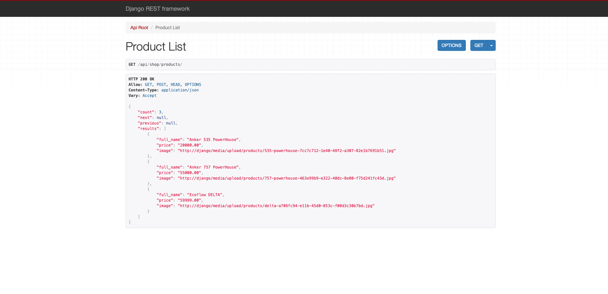
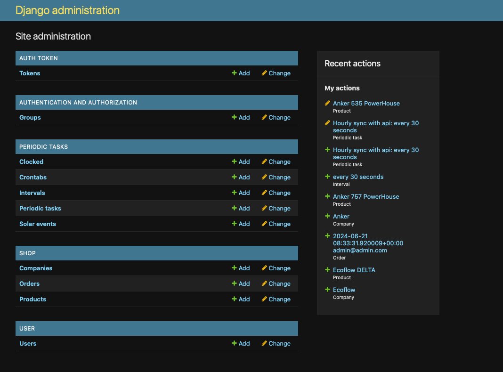
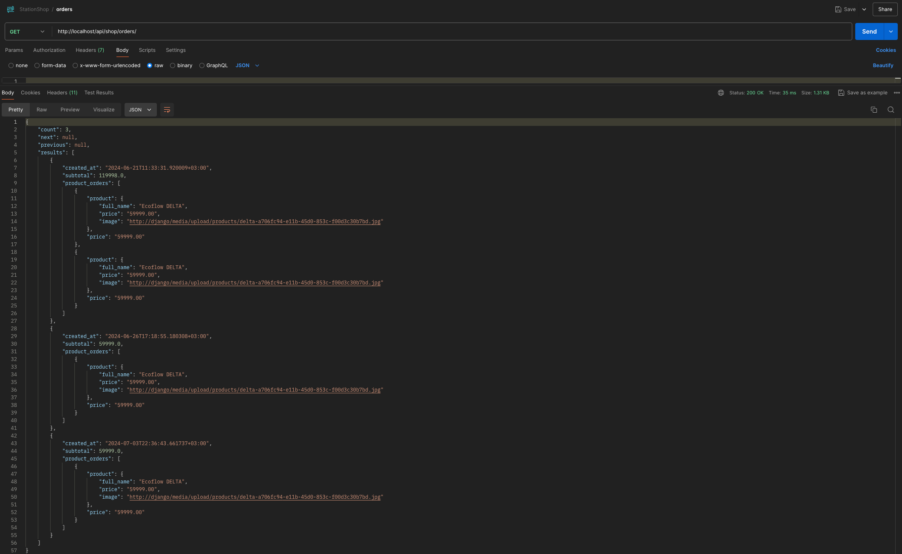
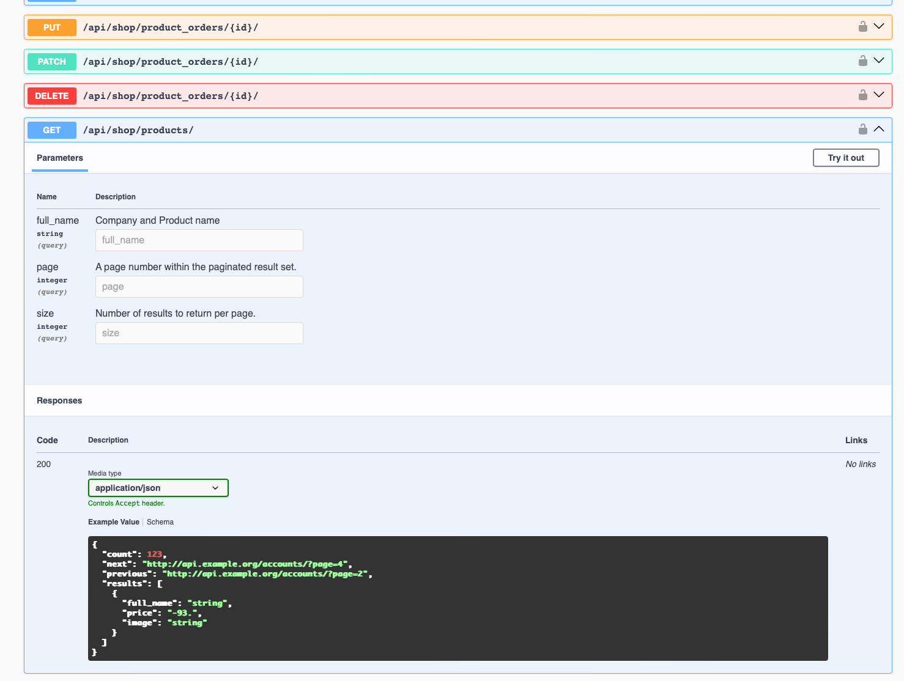

# Portable charging station shop

## About The App
online service for purchasing charging stations with Django Rest Framework


## Features
- Admin Panel
- JWT authentication
- Api documentation in /api/doc/(swagger, redoc)
- creating order, product, companies, productorders in orders
- media in /media/upload/products/
- search product by companies
- check

## Technologies
- Python 3.12 
- Django  5.0.6
- Django rest framework 
- Swagger
- Celery
- RabbitMQ
- Flower
- Gunicorn
- Nginx

## /products/

## Django Administration

## /orders/ by user

## /swagger/ 



## Installing the application via Github
```bash
git clone https://github.com/olefinbrabus/PortableChargingStationShop
cd PortableChargingStationShop
python -m venv venv
pip install -r requirements.txt
python manage.py collectstatic
```

## Setting environment keys
- Rename the File Sample.env to .env
- Enter the values you need in the keys

## Set Nginx configuration (without docker)
install 

- Copy text in ./nginx/nginx.conf
```bash
sudo nano /etc/nginx/conf.d/localhost
```
- Paste text
- Creating a symbolic link
```bash
sudo ln -s /etc/nginx/conf.d/localhost /etc/nginx/conf.d/
sudo systemctl reload nginx
```

## Launching the application through a local server(without docker)

- Install Postgres, RabbitMQ
- Run celery

```bash
celery -A portable_charging_station_shop worker -l info
```
- Run celery beat
```bash
celery -A portable_charging_station_shop beat -l INFO --scheduler django_celery_beat.schedulers:DatabaseScheduler
```
- Run flower
```bash
celery -A portable_charging_station_shop flower --address=0.0.0.0
```


```bash
python manage.py makemigrations
python manage.py migrate
gunicorn --bind 0.0.0.0:8000 portable_charging_station_shop.wsgi
```

## Launching an application via Docker
```bash
docker-compose up --build
```
